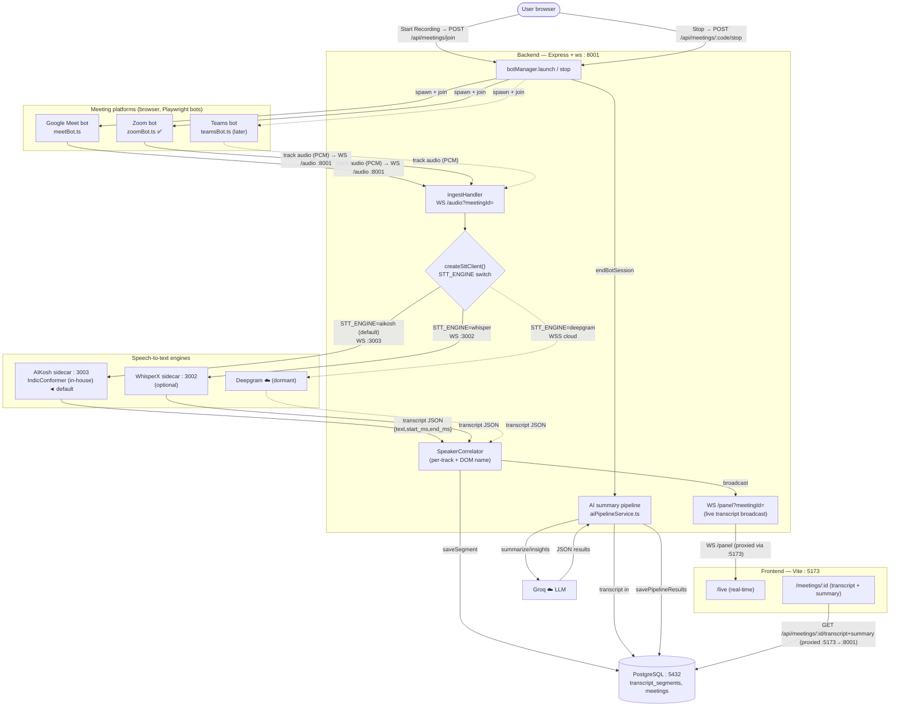

# NoteAI — Architecture & Data Flow

Ports, applications, and how audio/transcripts/summaries move between them.

## Port map

| Port | Application | Protocol | Role |
|------|-------------|----------|------|
| 5173 | Frontend (Vite/React) | HTTP + WS | UI; proxies `/api`, `/auth`, `/panel` → 8001 |
| 8001 | Backend (Express + ws) | HTTP + WS | REST API, `/audio` ingest, `/panel` live stream, bot orchestration |
| 3003 | AIKosh sidecar (Python) | WS | **In-house Indic STT** (IndicConformer-600M, MPS) — default |
| 3002 | WhisperX sidecar (Python) | WS | Alt local STT (optional) |
| 5432 | PostgreSQL | TCP | Meetings, transcript_segments, speakers, summaries |
| ☁️   | Deepgram | WSS | Cloud STT (dormant — only if `STT_ENGINE=deepgram`) |
| ☁️   | Groq | HTTPS | LLM summary/insights pipeline (post-meeting) |

## Flow



## One-line summary of the audio path (default, in-house)

```
Browser bot → PCM @16kHz → ws://localhost:8001/audio
   → ingestHandler → createSttClient(aikosh) → ws://localhost:3003 (IndicConformer)
   → transcript JSON → SpeakerCorrelator → Postgres :5432
   → /panel WS → Frontend :5173 (live)
On stop → AI pipeline → Groq ☁️ → summary → Postgres → /meetings/:id
```

Transcription is **fully on-device** (no Deepgram, no external API). Only the
post-meeting summary uses Groq.
